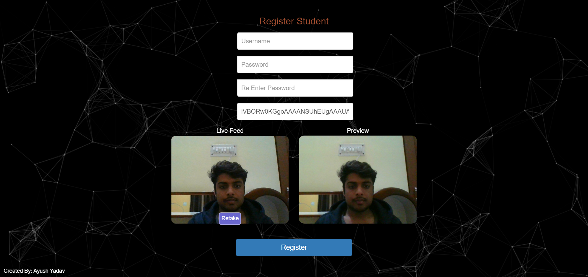
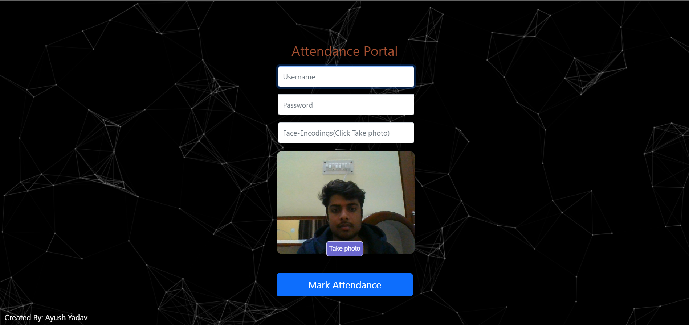
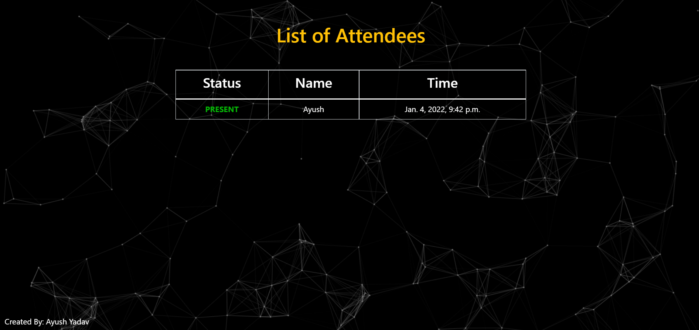

<h1 align="center">
  Scalar Hack X 2021
</h1>

<br/>
<br/>

<p align="center">
  
  <a ma href="https://face-attendance935.herokuapp.com/">
    
  </a>
  &nbsp;
  &nbsp;
  &nbsp;
  &nbsp;
  &nbsp;
  &nbsp;
  &nbsp;
  &nbsp;
  <a href="https://face-attendance935.herokuapp.com/">
    
  </a>
  
  <br/>
  <div align="center">
    <h3>Theme - Education</h2>
    <h3> Project - Attendance through Facial Recognition System</h2>
    <h3>Team Name - March #</h3><br/>
    Team Members - Ayush Yadav, Sushil Adwe</b>
  </div>
 
</p>

<br/>
<br/>

**Demo** : [Click here](https://face-attendance935.herokuapp.com/)<br/>
**PPT** : [Click here](https://docs.google.com/presentation/d/1ohDVjODKT071X2a1MdO18IM3xQzfvrrgfWj-DLpfOlk/edit?usp=sharing)


<!-- ABOUT THE PROJECT -->
## **About The Project**
This project aims to provide a valuable attendance service for both teachers and students. Reduce manual process errors by provide automated and a reliable attendance system uses face recognition technology.

It involves building an attendance system which utilizes facial recognition to mark the presence of the students. It covers areas such as face detection, alignment, visibility, and web application that provides user interface to use this functionality.


<br/>
<br/>


### **Tech Stack used**

* [Django](https://www.djangoproject.com/)
* [Python](https://www.python.org/)
* [Face-Recognition](https://github.com/ageitgey/face_recognition)
* [HTML & CSS]()
* [JavaScript](https://www.javascript.com/)

<br/>


### **Installation**
Anaconda must be installed on your system if running locally.

1. Clone the repo
   ```sh
   git clone https://github.com/ayushyadav9/face-attendance.git
   ```

2. Create a Python Virtual Environment
   ```sh
   conda create -n yourenvname
   ```
3. Activate the Virtual Environment
   ```sh
   conda activate yourenvname
   ```
4. Install the packages in requirements.txt
   ```sh
   pip install -r requirements.txt
   ```
5. After migrations run the server
   ```sh
   python manage.py runserver
   ```

<br/>

## **Screenshots**
<div align="center" ><br/>
Start with Registering the student on portal<br/><hr width=600/>
  <br/><br/>
After registrartion student can mark the attendence<br/><hr width=600/>
  <br/><br/>
Generating the attendence sheet<br/><hr width=600/>
  <br/>
</div>
<br/>

<!-- ROADMAP -->
## Roadmap
1) Adding functionality of registering students with admin face authentication
2) Integrating advanced Deep learning model that only recognizes 3-D faces. Currently the model recognizes 2-D faces also.
3) Generating an excel sheet of attendence list.


<br/>

<!-- CONTRIBUTING -->
### **Contributing**

Contributions are what make the open source community such an amazing place to be learn, inspire, and create. Any contributions you make are **greatly appreciated**.

1. Fork the Project
2. Create your Feature Branch (`git checkout -b feature/AmazingFeature`)
3. Commit your Changes (`git commit -m 'Add some AmazingFeature'`)
4. Push to the Branch (`git push origin feature/AmazingFeature`)
5. Open a Pull Request
   
<br/>

<!-- CONTACT -->
### **Contact**
Ayush Yadav - ayushyadav935@gmail.com

<br/>

<!-- ACKNOWLEDGEMENTS -->
### **Acknowledgements**

* [Bootstrap](https://getbootstrap.com)
* [Heroku](https://heroku.com)
